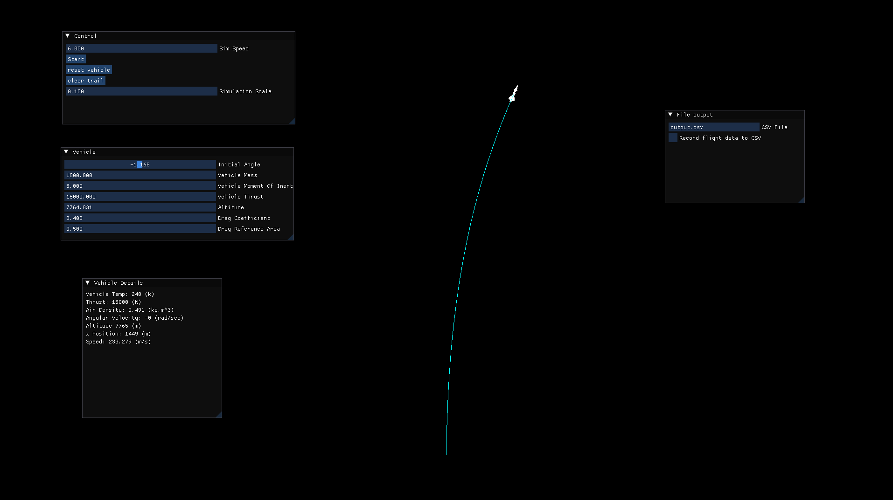

# Hyper Sonic

A 2D hypersonic vehicle simulation built in C++ with real-time visualization, basic atmospheric physics, GUI controls, and CSV data export for analysis.

## Overview

Hyper Sonic is a personal simulation project focused on modeling the motion of a high-speed vehicle traveling through Earth’s atmosphere. The project combines a deterministic physics simulation with an interactive graphical interface so the user can both observe and control the simulation in real time.

The simulation currently includes:

* 2D vehicle motion
* Gravity and aerodynamic drag
* Altitude-based air density
* Vehicle orientation and angular velocity
* Basic aerodynamic torque and rotational damping
* Real-time rendering with SFML
* GUI controls with ImGui
* CSV recording for later visualization and analysis

This project was built as a way to explore physics-heavy software systems, simulation architecture, and real-time application development in C++.

## Features

### Physics Simulation

* Fixed timestep simulation
* Vehicle position, velocity, and direction tracking
* Gravity and thrust forces
* Drag force based on atmospheric density and speed
* Atmospheric density that changes with altitude
* Rotational dynamics using angular velocity and moment of inertia
* Aerodynamic stabilizing torque based on mismatch between vehicle direction and velocity

### Visualization

* Real-time 2D rendering using SFML
* Vehicle sprite rendering
* On-screen simulation data display
* Support for trails and screen-space visualization of flight motion

### GUI

* Interactive controls through ImGui-SFML
* Adjustable starting parameters
* Simulation pause/play behavior
* Support for toggling CSV recording
* Hooks for future controls such as simulation speed, direction sliders, and altitude input

### Data Export

* CSV writer for recording simulation state over time
* Useful for external analysis and plotting in Python or other tools

## Project Structure

```text
HyperSonic/
├── Assets/                 # Textures, fonts, and other resources
├── include/                # Header files
├── src/                    # Source files
├── python/                 # Python scripts for CSV visualization
├── README.md
└── ...
```

Core classes currently include:

* **Vec2** - 2D vector math utilities
* **Vehicle** - stores vehicle state and properties
* **World** - provides environmental values such as gravity, density, and temperature
* **Simulation** - updates physics state over time
* **SimulationApp** - handles rendering, UI, and main application loop
* **CSVWriter** - writes simulation data to CSV files

## Tech Stack

* **C++**
* **SFML** for rendering and window management
* **ImGui-SFML** for GUI controls
* **Python / Matplotlib** for plotting recorded simulation data
* **Visual Studio** for development

## Current Physics Model

The current simulation uses a simplified atmospheric and flight model intended for experimentation and visualization rather than full physical accuracy.

Examples of modeled behavior include:

* Exponential air density falloff with altitude
* Drag based on velocity and air density
* Direction-based thrust
* Rotational response from aerodynamic torque
* Damping on angular velocity

This makes the project useful as a sandbox for testing simulation ideas, numerical integration, visualization systems, and future aerospace-inspired features.

## Building the Project

### Requirements

* C++ compiler with modern C++ support
* [SFML 3.x](https://www.sfml-dev.org/)
* [Dear ImGui](https://github.com/ocornut/imgui)
* [ImGui-SFML](https://github.com/SFML/imgui-sfml)
* Visual Studio on Windows, or another compatible C++ build environment

### General Build Notes

1. Install SFML and configure include/library directories.
2. Add ImGui and ImGui-SFML to the project.
3. Make sure required DLLs are available at runtime if linking dynamically.
4. Ensure assets such as textures and fonts are located in the expected paths.
5. Build and run the project from Visual Studio.

Because setup can vary depending on your environment, this repository is best built by opening the Visual Studio solution and verifying the external library paths first.

## Running the Simulation

Once built, the application opens a window showing the vehicle and simulation UI.

Typical workflow:

1. Launch the application.
2. Adjust starting conditions or parameters in the GUI.
3. Run the simulation.
4. Observe position, speed, and rotational behavior in real time.
5. Optionally record CSV data for plotting and analysis.

## CSV Output and Analysis

The project supports writing simulation data such as:

* time
* position
* speed
* direction
* angular velocity
* other future quantities such as temperature, pressure, or G-forces

A separate Python script can be used to visualize this output with Matplotlib.

## Planned Improvements

Some next steps for the project include:

* Improved aerodynamic heating / temperature model
* Pressure and G-force calculations
* More accurate atmosphere modeling
* Better parameter editing through the GUI
* Simulation speed controls
* Improved sprite orientation and camera behavior
* More detailed data logging
* Better graphs and replay tools
* Potentially more realistic reentry-style behavior

## Why I Built This

I built this project to combine several things I enjoy:

* simulation and physics programming
* C++ system design
* graphics and visualization
* engineering-oriented software

It also serves as a portfolio project that demonstrates work in numerical simulation, object-oriented design, GUI integration, and data tooling.

## Screenshots




## Future Vision

The long-term goal is to continue expanding Hyper Sonic into a more capable flight and atmospheric simulation sandbox, with better physical modeling and a cleaner user-facing interface.

## Author

**Hunter Rundhaug**

Computer Science student interested in simulation, systems programming, real-time software, and engineering-focused development.
